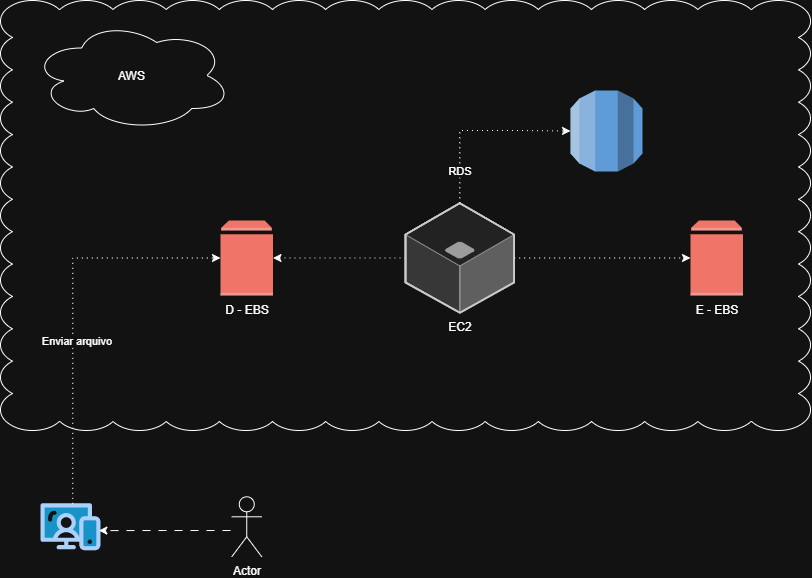
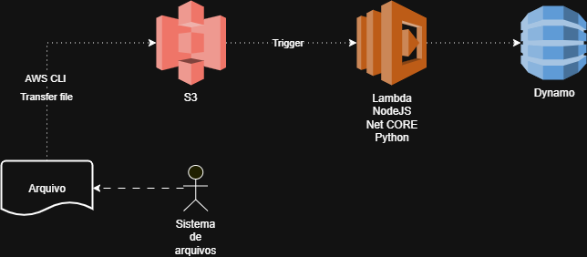

# 🏗️ Arquiteturas AWS — EC2, EBS, S3 e Lambda

Durante o desafio **“Gerenciando Instâncias EC2 na AWS”**, desenvolvi diagramas de arquitetura no **[Draw.io](https://app.diagrams.net/)** para representar visualmente o funcionamento dos principais serviços utilizados.  
Esses diagramas me ajudaram a compreender **como os recursos da AWS se conectam e interagem** entre si, antes mesmo de implementá-los na prática.

---

## 🧩 1. Arquitetura — Fluxo do Amazon EBS com EC2

### 📘 Descrição
Esta arquitetura representa o **fluxo de armazenamento entre uma instância EC2 e um volume EBS**.

- O **Amazon EC2** é a instância de computação onde o sistema operacional e as aplicações rodam.  
- O **Amazon EBS (Elastic Block Store)** fornece o armazenamento persistente em blocos usado pela instância.  
- Quando uma instância é **parada**, o volume EBS permanece ativo, garantindo a persistência dos dados.  
- Um **Snapshot** pode ser criado a qualquer momento para salvar o estado atual do volume, permitindo **backup ou clonagem** da instância.  
- Com base em um snapshot, é possível criar uma **AMI (Amazon Machine Image)** para reproduzir o ambiente em novas instâncias.

### 💡 Insight
O EBS funciona como um “disco rígido virtual”, enquanto o snapshot é como uma **foto instantânea** desse disco.  
Esse modelo garante **recuperação rápida de dados e ambientes** sem necessidade de reinstalar tudo do zero.

---

## 🧩 2. Arquitetura — Fluxo S3 + Lambda

### 📘 Descrição
Neste diagrama, ilustrei a **integração entre o Amazon S3 e o AWS Lambda** para automação de processos.

- O **Amazon S3** atua como **armazenamento de objetos**, recebendo arquivos enviados por usuários ou aplicações.  
- Quando um novo arquivo é adicionado ao bucket, ele **dispara um evento (trigger)**.  
- Esse evento **invoca automaticamente uma função Lambda**, sem necessidade de servidores dedicados.  
- A **função Lambda** pode processar o arquivo (por exemplo: redimensionar uma imagem, converter um formato ou mover o arquivo para outro bucket).
- O Lambda grava os dados do pedido no DynamoDB, que é um serviço de banco de dados NoSQL totalmente gerenciado da AWS.
- Logs e resultados são enviados para o **Amazon CloudWatch**, permitindo o monitoramento da execução.

### 💡 Insight
A integração entre S3 e Lambda demonstra o poder do **modelo serverless**, no qual o código é executado sob demanda, **reduzindo custos e simplificando a manutenção**.

---

## 🧠 3. Benefícios de Planejar Arquiteturas

Durante o desafio, percebi que visualizar a infraestrutura antes de criá-la é uma **prática essencial para o sucesso de qualquer projeto em nuvem**.

📋 **Principais vantagens:**
- Clareza sobre a comunicação entre os serviços.  
- Redução de erros de configuração na hora da implementação.  
- Melhor compreensão de dependências e pontos de falha.  
- Facilita a explicação e documentação do projeto para outras pessoas.

💬 *Insight pessoal:*  
> “Planejar a arquitetura é o primeiro passo para construir uma nuvem eficiente, segura e escalável.”

---

## 🧭 4. Ferramenta Utilizada

📌 **Draw.io (diagrams.net)**  
Uma ferramenta gratuita e online utilizada para criar os diagramas acima.  
Permite montar fluxos com ícones oficiais da AWS, facilitando a comunicação visual dos projetos.

📘 **Boas práticas que utilizei:**
- Padronização das cores e ícones dos serviços AWS.  
- Uso de legendas e setas direcionais para facilitar o entendimento.  
- Exportação dos diagramas em formato `.png` e `.drawio` para versionamento.

